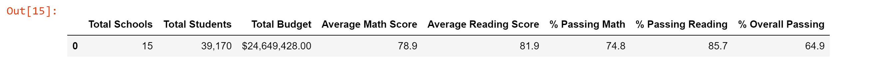
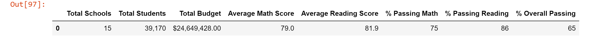
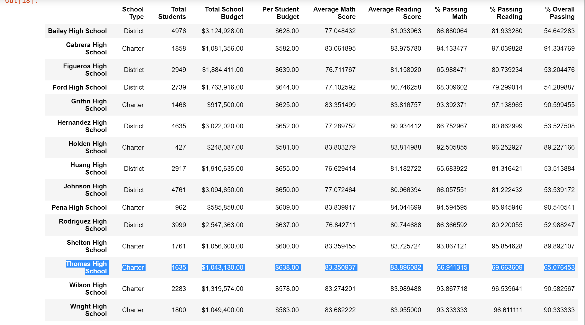
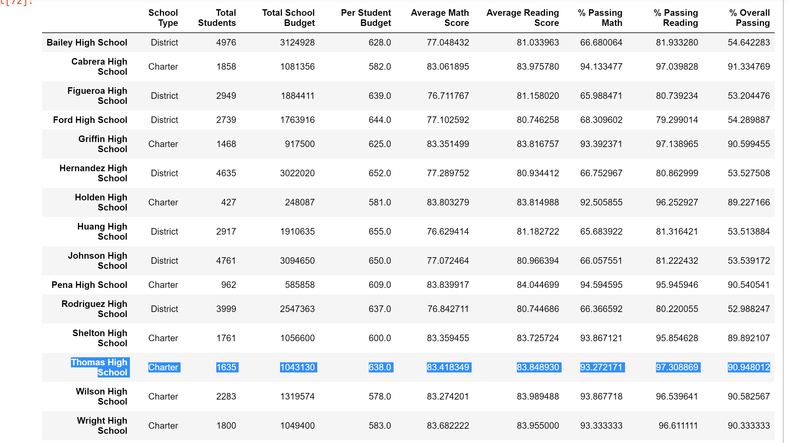

# School_District_Analysis

## Overview of the school district analysis:
  
Maria, the chief data scientist for a city school district , is responsible for analyzing information from a variety of sources, and a variety of formats. She is tasked to prepare all standardized test data for analysis, reporting, and presentation to provide insight about performance trends and patterns. Theses insights are used to inform discussions and strategic decisions at the school district level. The purpose of the module is to help Maria analyze data on student funding and students’ standardized test scores. Our task is to aggregate the data and showcase trends in school performance. This analysis will assist the school board and superintendent in making decisions regarding the school budgets and priorities.

This challenge is about how the school board has notified Maria and her supervisor that the student_complete.csv file shows evidence of academic dishonesty; specifically, reading and math grades for Thomas High School ninth graders appear to have been altered. Although the school board does not know the full extent of the academic dishonesty, they want to uphold state-testing standards and have turned to Maria for help. We had to replace the math and reading scores for Thomas High School with NaNs while keeping the rest of the data intact. Once we replaced the math and reading scores, we just had to repeat the school district analysis that was done in the module and write up a report to describe how these changes affected the overall analysis.

## Results: 
### How is the district summary affected:

- In the module the district summary was 79.0 average math score, 75 % passing math, 86 % passing reading, and 65 % overall passing. The challenge district summary 78.9 average math score, 74.8 % passing math, 85.7 % passing reading, and 64.9 % overall passing. The average math scores, % passing math, % passing reading, and % overall passing only slightly changes when replacing the math and reading scores with NaNs. The average reading score for both didn’t change at all by staying at 81.9. 

Challenge District Summary:

Module District Summary: 

### How is the school summary affected:

- The school summary was affected because in the images below you can tell the average math, average reading, % passing math, %passing reading, and % overall passing for Thomas High School are different. Look at the Challenge School Summary and the Module School Summary for Thomas High School.

Challenge School Summary:

Module School Summary:

### How does replacing the ninth graders’ math and reading scores affect Thomas High School’s performance relative to the other schools:

- Prior to replacing the 9th grader's math and reading scores for Thomas High School, the school was doing relatively fine with a 91% overall passing percentage. After our changes, their overall passing percentage decreased to 65%.

### How does replacing the ninth-grade scores affect the following:

#### Math and reading scores by grade:
- The math and reading scores by grade are replaced with NaNs.
#### Scores by school spending:
- Scores by School Spending changed at the $630-644 range: the percentage passing math dropped from 73.48% to 73.46% - percentage passing reading dropped from 84.39% to 84.31% - overall passing percentage dropped from 62.85% to 62.77%
#### Scores by school size:
- Scores by School Size did not change. It remained the same. 
#### Scores by school type:
- Scores by School Type did not change. It remained the same.

## Summary

The four major changes in the updated school analysis:

- The math and reading scores were replaced with NaNs that change the dataframes.
- Scores by school spending had dropped but with no significant change.
- We can clearly see the changes did not effect school size and school type.
- The district summary was affected the most.